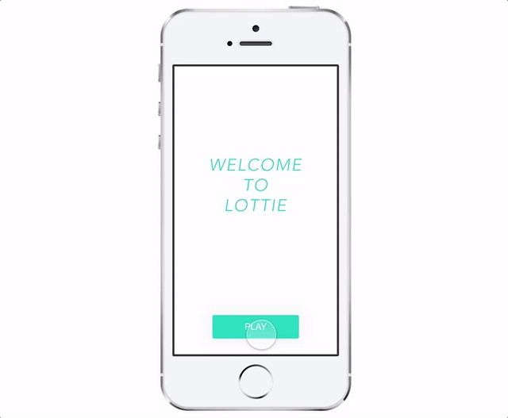

# Framer lottie 模块
【[English version](#a-framer-module-to-visualize-music)】

这个 Framer module 将 Airbnb 的 Lottie 结合进来，让你能够通过 Framer 加载 AE 导出的动画，并能控制它的播放停止。

### 使用方法

先在你的`项目文件夹/modules`里面添加`lottieFramer.coffee`文件，然后再在主文件`app.coffee`中添加以下代码。

初始化 lottieFramer 对象：

```CoffeeScript
lf = require 'lottieFramer'
# 新建一个 lottie 图层
lottieL = new lf
	width: 100
	height:100
	backgroundColor: '#09C'
```

### 效果演示

这是我写的一个效果，让方块的`scale`随着音乐节奏变化（参见项目visualMusic.framer）。



你可以下载下来并参考里面的代码实现你自己的创意，玩的开心哦。

____
